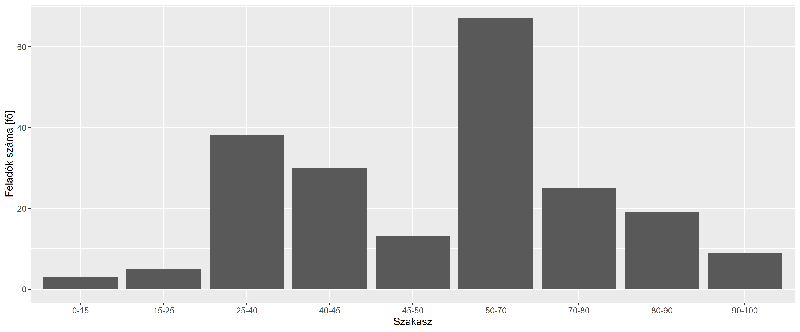
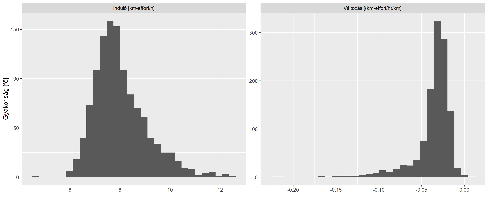
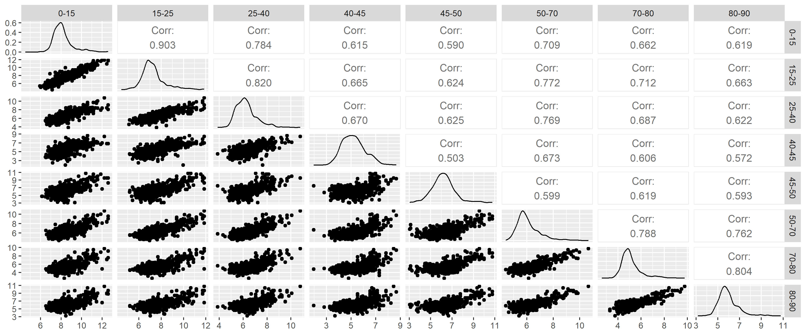

A 2022-es Kinizsi 100 adatainak elemzése
================
Ferenci Tamás

## Bevezető gondolatok

A Kinizsi 100 Magyarország legnagyobb hagyományú – és egyik legkeményebb
– teljesítménytúrája. A feladat egyszerű: 100 km, 24 óra (és nagyjából
3200 méter összesített szintemelkedés). Az útvonalban néha apróbb
változások vannak bizonyos években, de alapvetően budapesti indulás után
átkel a Pilisen majd a Gerecsén. Számos további információ érhető el a
[túra honlapján](http://kinizsi.org/kinizsi-szazas/) és a
[Wikipedián](https://hu.wikipedia.org/wiki/Kinizsi_Sz%C3%A1zas).

2022-ben került megrendezésre a 40. alkalommal a túra. Ebben az évben az
indulókat online is nyomon lehetett követni: minden ellenőrzőpont
érintésekor felkerült az áthaladás ideje egy bárki számára megtekinthető
weboldalra (a séma: szazas.kinizsi.org/RSZ, ahol az RSZ helyébe a túrázó
rajtszámát kell írni, vezető nullák nélkül; például a jelen sorok
szerzőjének lapja: <https://szazas.kinizsi.org/125>). Az időpontokból
rekonstruálható minden túrázó sebessége, így – mivel az adatok gépi úton
könnyen letölthetőek az összes indulóra – összeállíthatunk néhány
elemzést arra vonatkozóan, hogy összességében hogyan haladtak végig a
túrázók az úton.

## Technikai részletek: az adatok letöltése és feldolgozása

Az adatok letöltését és vizsgálatát [R statisztikai
környezet](https://www.youtube.com/c/FerenciTam%C3%A1s/playlists?view=50&sort=dd&shelf_id=2)
alatt végeztem. Ha valakit ezek a részletek nem érdekelnek, akkor ezt a
fejezetet és a később közölt kódokat nyugodtan ugorja át, de azért
feltüntetem a transzparencia kedvéért, valamint, hogy az érdeklődők azt
is lássák, hogy mi történik a háttérben.

Elsőként betöltjük az adatok kezeléséhez és a későbbi vizualizációhoz
használt `data.table` és a `ggplot2` csomagokat:

``` r
library(data.table)
library(ggplot2)
```

Ezt követően leszedhetjük az adatokat. A webscraping-hez az erre a célra
szolgáló `rvest` csomagot használjuk. Minden oldal esetében kiszedjük a
HTML táblázatokat, ezek közül a harmadiktól kezdődően találjuk meg a
teljesítési adatokat (az ellenőrzőpont távolságát és az érintés
időpontját). Az némi kézi kísérletezéssel megtalálható, hogy az utolsó
rajtszám az 1396-os volt:

``` r
if(!file.exists("K100res_2022.rds")) {
  res <- rbindlist(lapply(1:1396, function(i) {
    tab <- rvest::html_table(rvest::read_html(paste0("https://szazas.kinizsi.org/", i)))
    if(length(tab)<=2) NULL else cbind(data.table(t(do.call(cbind, tab[-(1:2)])))[, -2], i)
  }))
  
  res <- res[, .(ID = i, KM = V1, TIME = V3)]
  res$KM <- as.numeric(res$KM)
  
  saveRDS(res, "K100res_2022.rds")
} else res <- readRDS("K100res_2022.rds")
```

A kapott adatbázison érdemes még néhány átalakítást tenni. Egyrészt az
(óra)időpontokból számoljuk ki az eltelt időt; ehhez a `hms` csomagot
használjuk, egyedül arra kell vigyázni, hogy az éjfél utáni időpontok
egy nappal később vannak:

``` r
res[, TIME2 := as.numeric(hms::parse_hm(TIME)-hms::parse_hm(TIME)[1]), .(ID)]
res$TIME2 <- ifelse(res$TIME2>=0, res$TIME2, res$TIME2 + 24*60*60)
```

Másrészt érdemes pontosítani a távolságokat: a weboldalon megjelenített
– és az általunk is letöltött – távolságok csak kerekítettek, lényegében
az ellenőrzőpont elnevezését jelentik. Úgyhogy szedjük ki a pontos
távolságokat [az itiner](http://kinizsi.org/utvonal-ellenorzo-pontok/)
alapján:

``` r
res <- merge(res, data.table(KM = c(0, 15, 25, 40, 45, 50, 70, 80, 90, 100),
                             TRUEKM = c(0, 14.13, 26.08, 42.27, 46.12, 51.18,
                                        71.56, 82.44, 91.64, 98.7)), sort = FALSE)
```

Az elemzéshez jól jöhet még a szintemelkedés is, ezt szintén rakjuk
hozzá az adatbázishoz, ismét csak az itiner alapján:

``` r
res <- merge(res, data.table(KM = c(0, 15, 25, 40, 45, 50, 70, 80, 90, 100),
                             TRUEASCENT = c(0, 705, 1090-705, 1519-1090, 1669-1519,
                                            1863-1669, 2654-1863, 2785-2654, 3140-2785,
                                            3150-3140)), sort = FALSE)
```

Néhány ábra – azok, ahol nem a valós kilométert használjuk, hanem az
ellenőrzőpontokat – világosabb lesz, ha jelezzük, hogy az egyes
ellenőrzőpontoknál feltüntetett sebesség úgy értendő, hogy az adott
ellenőrzőpont és a *megelőző* ellenőrzőpont *közötti* szakasz sebessége
(nehogy valaki azt gondolja, hogy a 70 km azt jelenti, hogy az elejétől
a 70-es pontig összesen mennyi volt az átlagsebesség). Ezt segíthetjük
jobb címkékkel:

``` r
res <- merge(res, data.table(KM = c(0, 15, 25, 40, 45, 50, 70, 80, 90, 100),
                             KMTEXT = c("0", "0-15", "15-25", "25-40", "40-45", "45-50",
                                        "50-70", "70-80", "80-90", "90-100")),
             sort = FALSE)
```

Most már semmi akadálya, hogy meghatározzuk a két pont között eltelt
időt, távolságot, végül pedig ez alapján a sebességet (km/h
mértékegységben; arra figyeljünk, hogy a fenti módon kapott idő
másodpercben van):

``` r
res[, KMDIFF := c(NA, diff(TRUEKM)), .(ID)]
res[, TIMEDIFF := c(NA, diff(TIME2)), .(ID)]
res$SPEED <- res$KMDIFF/(res$TIMEDIFF/(60*60))
```

Mentsük el azt is, hogy ki volt sikeres teljesítő: az, akinél van 100
km-es bejegyzés.

``` r
res <- merge(res, res[, .(SUCCESS = 100%in%KM), .(ID)], sort = FALSE)
```

Itt érdemes megjegyezni, hogy a célidő nincs feltüntetve a weboldalon.
Ennek hivatalos magyarázata nem érhető el az oldalon, de elég
egyértelműnek tűnik, hogy ebben is az a szervezők által konzekvensen
képviselt meggyőződés tükröződik, miszerint a teljesítménytúra nem
verseny: egyedül az számít, hogy valaki szintidőn belül beér-e, de ha
igen, akkor nem számít, hogy milyen gyorsan.

Ezek az adatok most, úgy szokták mondani: ‘long’ formátumban vannak
(ugyanazon alany különböző adatai egy oszlopban, egymás alatt, egy másik
oszlopban lévő változóval megkülönböztetve). Bizonyos elemzésekhez jól
jöhet a ‘wide’ formátum is (különböző adatok különböző oszlopokban);
gyártsuk le ezt is:

``` r
resWide <- dcast(res, ID ~ paste0("SPEED", KM), value.var = "SPEED")[, -c("SPEED0", "SPEED100")]
resWide <- merge(resWide, res[, .(SUCCESS = 100%in%KM), .(ID)], sort = FALSE)
```

## A feladások vizsgálata

Noha az utolsó rajtszám, mint már volt róla szó, az 1396-os, valójában
kevesebb tényleges induló volt (a rajtszámok egy részéhez olyan oldal
tartozik, amin egyáltalán semmilyen információ nincs, még csak egy
rajtidőpont sem – sejthetőleg ezek a túrázók el sem indultak). Az ilyen
értelemben tényleges indulók száma 1202, közülük 993 teljesítette
sikeresen a 2022-es Kinizsi 100-at; ez 82.6%-os arány.

Érdekes megnézni, hogy a túrát feladók hol szálltak ki. Az alábbi ábrán
a kilométerek az utolsó ellenőrzőpontot jelentik, ahol még sikeresen
áthaladt az adott túrázó, magyarán a kiszállás igazából ezen
ellenőrzőpont után (de még a következő előtt) történt:

``` r
ggplot(data.table(table(res[, .(max(KM)), .(ID)][V1!=100]$V1)), aes(x = V1, y = N)) +
  geom_bar(stat = "identity") +
  labs(x = "Utolsó teljesített ellenőrzőállomás", y = "Feladók száma [fő]")
```

<!-- -->

## Sebesség alakulása a túra alatt

Kezdjük először a sebesség vizsgálatával! Az első kérdés ami felmerül,
hogy az egyes szakaszokon – a szakasz alatt értve a két ellenőrzőpont
közötti távot – milyen gyorsan haladtak a túrázók. Ez persze nem egy fix
érték: van aki gyorsabban haladt, van aki lassabban, azaz a sebességnek
eloszlása van. Ezt szemléltetjük az alábbi ábrán, minél magasabban fut
valahol a görbe, annál gyakoribb az olyan sebesség körüli teljesítés:

``` r
ggplot(res, aes(x = SPEED, group = KMTEXT, color = KMTEXT)) + geom_density() +
  labs(x = "Sebesség [km/h]", y = "", color = "Szakasz [km]") +
  scale_y_continuous(labels = NULL, breaks = NULL)
```

<!-- -->

Látszik tehát, hogy a leggyorsabb szakasz a rajt és a 15-ös pont
közötti, illetve a 15 és 25 közötti volt, onnan nagyjából folyamatos a
lassulás, bár azért nem teljesen egyenletesen (a leglassabb például jól
láthatóan a 45-ös pont előtti szakasz).

Már a fenti értelmezés is mutatja, hogy bár ez az ábra sok szempontból
informatív, de az időbeli alakulást nem mutatja jól. Jó lenne egy olyan
diagram, aminek a vízszintes tengelyén a táv van, és ennek fényében
mutatja a sebességet! Esetleg gondolhatunk arra, hogy a
sebesség-eloszlást színezéssel jelenítjük meg, de ez a kevés
ellenőrzőpont miatt elég sután nézne ki. Válasszunk egy másik megoldást:
rajzoljuk ki egy vonallal minden egyes túrázó sebességének az
alakulását, külön-külön! Ennek elvileg még egy nagy előnye lehetne a
fenti ábrához képest: az, hogy mutatja azt is, hogy a különböző
szakaszokon mért sebességek között mi a kapcsolat, tehát, hogy ha valaki
egy szakaszon gyors, akkor utána vajon lassabb-e, vagy ott is gyorsabb,
később hogyan alakul a sebessége stb. Ez sajnos nem nagyon valósul meg,
mert a túrázók hatalmas száma miatt nem igen lesz leolvasható – de az
összkép nagyon is (a piros vonal az egyes szakaszok sebességének a
mediánja):

``` r
ggplot(res[, .(SPEED = median(SPEED)) , .(TRUEKM)], aes(x = TRUEKM, y = SPEED)) +
  geom_line(data = res, aes(group = ID), size = 0.1, alpha = 0.1) +
  geom_line(color = "red") + geom_point(color = "red") +
  labs(x = "Táv [km]", y = "Sebesség [km/h]")
```

<!-- -->

Lényegében a vonalkák sűrűsége mutatja azt, amit az előző ábrán az
jelzett, hogy milyen magasan futott a görbe: ahol sok vonalka fut, az a
sebesség gyakran fordul elő. (Nem véletlenül hívják az előző ábrán
látható eloszlást pontos nevén sűrűségfüggvénynek.)

Így már sokkal jobban látszik a sebesség időbeli alakulása, és azért
ennek az eloszlásáról is lehet benyomást szerezni. Felvethető azonban az
a – teljesen jogos – kritika, hogy ezek az ábrák, illetve egyáltalán, a
használt sebesség mint mérőszám nincsen tekintettel a szintre: lehet,
hogy ahol leesik a sebesség, ott nem a túrázók lassultak maguktól, csak
egyszerűen meredekebb volt az adott szakasz, miközben a túrázók
erőfeszítései egyáltalán nem csökkentek.

A szint figyelembevétele nem nyilvánvaló feladat. Évszázados
bölcsességtől az egészen összetett függvényekig számos megoldás van rá;
az egyik leghíresebb a
[Naismith-szabály](https://en.wikipedia.org/wiki/Naismith%27s_rule). Ez
eredeti formájában úgy fogalmazott, hogy minden 3 mérföldre számolni
kell egy órát, és minden 2000 láb emelkedésre még egy órát hozzáadni;
metrikusra úgy szokták fordítani, hogy minden 5 km egy óra, és minden
600 méter szintre még egyet hozzá kell adni. Azonnal látszik, hogy a
dolog erősen közelítő, kezdve azzal, hogy a lejtőt úgy tekinti mintha
vízszintes lenne (ami ráadásul mindkét irányban hibás: enyhe lejtő
segít, de ez sem általánosítható tetszőlegesen, hiszen egy ponton túl
nem csak, hogy nem segít a lejtő, de szintén lassítani fog). Vannak
szabályok ennek figyelembevételére is (például a
[Tobler-függvény](https://en.wikipedia.org/wiki/Tobler%27s_hiking_function)),
de mi most maradjunk ennél, mert két előnye is van. Az egyik a
kényelmessége és az elterjedtsége, hogy mást ne mondjak, a Magyar
Természetjáró Szövetség is lényegében [ez alapján
számolja](http://mtsz.org/images/stp_attachment/0/179/turista%20%C3%BAtvonalak%20%C3%BAtelz%C5%91%20t%C3%A1blarendszere_20140206.pdf?805017193187308011)
a turistautak tábláin feltüntetett időket. Van azonban egy számunkra még
fontosabb tulajdonsága: lehetővé teszi a szintet tartalmazó távolságok
átszámítását ekvivalens, azaz erőfeszítésben egyenértékű, de szint
nélküli hosszúságra. Például Naismith eredeti szabálya úgy is elmondható
lenne, hogy minden 600 méter szint után adjunk 5 km-t hozzá az út
hosszához, avagy, kis kerekítéssel, minden 100 méter után 1 km-t: az így
kapott hosszúságú (de szint nélküli!) út megtételéhez a szabály alapján
ugyanannyi idő kell, mint az eredeti, rövidebb, de szintet tartalmazó út
megtételéhez. Lényegében egy effektív hosszt kapunk; szokták ezt néha
km-effort néven („kilométer-erőfeszítés”) emlegetni. Ez azért fontos,
mert így megszabadulhatunk az eredeti szabályban szereplő konkrét
tempótól: abból nem akarunk kiindulni, hogy a túrázó vízszintes úton
vett alapsebessége 5 km/h (Naismith) vagy 4 km/h (MTSZ) vagy egyáltalán
bármilyen konkrét szám, illetve ez nekünk most nem is lényeges. Ha
azonban a szabályból csak a km-effort-ra való átszámítást használjuk
(lényegében az átváltást a szint és a hossz között), akkor ez meg sem
jelenik: csak kapunk egy olyan értéket, ami már figyelembe veszi a
szakasz szintjét is, egyetlen értékben – pont amire szükségünk volt.
(Természetesen az azért benne lesz az eredményben, hogy váltószám mi,
tehát az rajtunk múlik, hogy hogyan ítéljük meg az átváltást szint és
táv között.)

Használva most a 100 m / 1 km átváltást, számoljuk ki ezt a
km-effort-ot, és nézzük meg ez hogyan alakult az út során:

``` r
res$SPEEDEFFORT <- (res$KMDIFF + (res$TRUEASCENT/100))/(res$TIMEDIFF/(60*60))

resEffortWide <- dcast(res, ID ~ paste0("SPEEDEFFORT", KMTEXT),
                       value.var = "SPEEDEFFORT")[, -c("SPEEDEFFORT0", "SPEEDEFFORT90-100")]
resEffortWide <- merge(resEffortWide, res[, .(SUCCESS = 100%in%KM), .(ID)], sort = FALSE)

ggplot(res[, .(SPEEDEFFORT = median(SPEEDEFFORT)) , .(TRUEKM)], aes(x = TRUEKM, y = SPEEDEFFORT)) +
  geom_line(data = res, aes(group = ID), size = 0.1, alpha = 0.1) +
  geom_line(color = "red") + geom_point(color = "red") +
  labs(x = "Táv [km]", y = "Korrigált sebesség [km-effort/h]")
```

<!-- -->

Gyönyörűen látszik, hogy egy furcsaságot azonnal eltüntettünk: az
eredeti ábrán az első szakasz után gyorsulás történt, holott valójában
csak arról van szó, hogy a legelső szakaszban relatíve sok szint van. Ha
ezt figyelembe vesszük, ahogy a km-effort-tal tettük, akkor ez eltűnik,
és azt látjuk, hogy folyamatos a csökkenés!

Két ponton törik meg a görbe még így is, a 45-ös és a 80-as pontoknál;
ezek okának felderítése érdekes kérdés lenne…

Ha most eltekintünk ezektől a megtörésektől, akkor megpróbálkozhatunk,
az ábra alapján nem értelmetlennek tűnő módon, azzal, hogy minden túrázó
sebességének alakulását egyszerűen egy egyenessel írjuk le, tehát, hogy
a fenti vonalakra egy – rájuk legjobban illeszkedő – egyenest húzunk. Az
egyenes azért is kényelmes, mert így hivatkozhatunk arra, hogy ez a
trendje a (korrigált) sebesség alakulásának.

Tegyük ezt meg minden túrázóra, majd ábrázoljuk az eredményeket! Az
egyenest két érték jellemzi: az induló sebesség (a 0 km-nél érvényes
korrigált sebesség a trendvonal szerint) és a változás (1 km megtétele
alatt mennyit változik a korrigált sebesség):

``` r
linfit <- res[, as.list(tryCatch(coef(lm(SPEEDEFFORT ~ TRUEKM)),
                                 error = function(e) c(NA_real_, NA_real_))), .(ID)]
names(linfit)[2:3] <- c("Induló [km-effort/h]", "Változás [(km-effort/h)/km]")
ggplot(melt(linfit, id.vars = "ID"), aes(x = value)) +
  facet_wrap(~variable, scales = "free") + geom_histogram() +
  labs(x = "", y = "Gyakoriság [fő]")
```

<!-- -->

Jól látszik a kezdőérték eloszlása, és az, hogy az abszolút túlnyomó
többségnek tényleg csökkenő trendet mutatott a (korrigált) sebessége a
túra alatt! Jobban megnézve azért lehet látni, hogy mintha volna pozitív
trendű túrázó is, és csakugyan: 2 túrázó trendjében gyorsult a túra
teljesítése alatt.

## Különböző szakaszok sebességeinek összefüggése

Felmerül a kérdés, hogy mi a kapcsolat a különböző szakaszon
teljesítésének (korrigált) sebességei között: aki egy szakaszon gyorsabb
volt, az egy másikon is az lesz?

Ennek legegyszerűbb ábrázolási eszköze a szóródási diagram: minden pont
egy túrázó, a vízszintes tengelyen oda rakjuk ahol az egyik, a
függőleges tengelyen pedig oda, ahol a másik vizsgált szakaszon volt a
sebessége. Minden azonnal érthetőbb lesz, ha megnézzük ábrán, példaként
vegyük az első két szakaszt (a piros vonal jelzi azt, ahol épp azonos
volt a két szakaszon a sebesség):

``` r
ggplot(resEffortWide, aes(x = `SPEEDEFFORT0-15`, y = `SPEEDEFFORT15-25`)) + geom_jitter() +
  labs(x = "Korrigált sebesség a 15 km-es ellenőrzőpontig [km-effort/h]",
       y = "Korrigált sebesség a 15 és 25 km-es\nellenőrzőpont között [km-effort/h]") +
   geom_abline(color = "red")
```

<!-- -->

Jól látszik, hogy a két szakaszon mért sebesség között nagyon szoros,
pozitív – és szinte lineáris – volt a kapcsolat: aki az egyiken gyorsabb
volt, az a másikon is, és szinte arányosan. Az, hogy a pontok a piros
vonal alatt vannak többségében nem meglepő: már korábban is láttuk, hogy
a második szakasz átlagosan lassabban ment.

(Technikai megjegyzés: amit látunk, az igazából egy ún. jitterelt
szóródási diagram. A probléma, hogy – különösen az első, de azért a
második szakaszon is – vannak olyan emberek, akik *pontosan* ugyanannyi
idő alatt teljesítették a szakaszt. Például 48 ember van, aki pontosan
156 perc alatt tette meg az első szakaszt, és így persze a
km-effort/h-juk is egzaktan egyezik. Ez azért gond, mert az ilyen pontok
hajszálpontosan ugyanoda kerülnek a szóródási diagramon, márpedig ha két
pont tökéletesen egymásra rajzolódik, akkor onnantól kezdve nem
tudhatjuk, hogy ott hány pont esett egybe: kettő vagy kétezer…? A
jitterelés ezt a problémát oldja meg, azáltal, hogy egy nagyon-nagyon
kicsi véletlen zajt kever a pontra, azaz nagyon picit odébbmozgatja egy
véletlen értékkel. Ez érdemben nem fogja elrontani a diagramot, hiszen
csak picit mozogtak a pontok, viszont cserében láthatóvá válik sokkal
jobban, ha esetleg egy pozícióban több pont is egybeesik: a jitterelés
után a pontok nem egybeesnek, hanem azon a környéken lesznek mind, de
sűrűn – épp amire szükségünk volt.)

De akkor már ne álljunk meg félúton: miért nem nézzük meg a kapcsolatot
az *összes* lehetséges szakasz sebessége között? Ennek a klasszikus
elrendezése a mátrix szóródási diagram:

``` r
GGally::ggpairs(resEffortWide[, -c("ID", "SUCCESS")],
                columnLabels = substring(colnames(resEffortWide[, -c("ID", "SUCCESS")]), 12),
                upper = list(continuous = GGally::wrap(GGally::ggally_cor, stars = FALSE)))
```

<!-- -->

Az ábrát a következőképp kell értelmezni. Minden sor és oszlop egy
szakaszon mért sebesség. A főátlóban a kérdés szakasz sebességének az
eloszlása van – ezt már korábban is láttuk. Az átló alatt az adott sor
és adott oszlop által meghatározott pár szóródási diagramja – például a
felülről második sor bal szélső szóródási diagramja ugyanaz, amit az
előbb láttunk nagyban is. Csak épp ezen az ábrán látható, mégpedig
logikus elrendezésben, az összes többi is! Láthatjuk, hogy a
megállapításaink – pozitív a kapcsolat, szoros, lineáris – alapvetően
továbbra is igazak, bármely párra, egyedül a szorosság gyengébb bizonyos
esetekben (és néhol a linearitás sem annyira vegytiszta). Az átló felett
egyetlen számba sűrítve – szép néven: korrelációs együttható – látszanak
a fentiek: ha a szám pozitív, akkor a kapcsolat pozitív, és minél
közelebb van az 1-hez annál szorosabb az összefüggés. (Vigyázat, ez az
együttható kizárólag a lineáris kapcsolatot méri, de szerencsére az
ábrákból látható módon ez elfogadhatóan fennáll minden esetben.)

Összességében tehát elmondható, hogy aki egy szakaszt az átlagnál
gyorsabban teljesít, az valószínűleg bármely más szakaszt is az átlagnál
gyorsabban teljesít, sőt, egy szakaszbeli sebesség alapján elég jól
megjósolható az összes többiben mutatott sebesség is.

## Sikeres teljesítése előrejelzése a sebesség alapján

Egy érdekes lehetőség annak vizsgálata, hogy a sebesség előrejelzi-e
azt, hogy valaki sikeresen teljesíti a túrát. Nézzük meg, hogy a legelső
szakaszon mutatott sebesség milyen összefüggésben van a sikerességgel!
Mivel itt csak egyetlen szakaszt vizsgálunk, így egy-egy megfeleltetés
van a korrigált és a szokásos sebesség között, így mindkettőt
feltüntethetjük:

``` r
ggplot(resEffortWide, aes(x = `SPEEDEFFORT0-15`, y = as.numeric(SUCCESS))) +
  geom_smooth(method = mgcv::gam, method.args = list(family = "binomial"), formula = y ~ s(x)) +
  scale_x_continuous("Korrigált sebesség a 15 km-es ellenőrzőpontig [km-effort/h]",
                     sec.axis = sec_axis(~ . /(1 + 7.05/14.13),
                                         name = "Sebesség a 15 km-es ellenőrzőpontig [km/h]")) +
  scale_y_continuous(labels = scales::percent) +
  labs(y = "Sikeres teljesítés valószínűsége [%]")
```

<!-- -->

A dolog egyfelől logikus, de talán azért kicsit meglepő is. Logikus,
mert azt látjuk, hogy aki gyorsabban ment, az nagyobb valószínűséggel
teljesítette sikeresen a túrát. (Mindazonáltal ez az effektus csak egy
pontig érvényesül: nagyjából 9 km-effort/h, avagy – itt – 6 km/h felett
már szinte mindenki sikeresen célba ért, aki ilyen tempóban tudta le az
első szakaszt.) Másrészt azt látjuk, hogy aki – szokásos sebességben – 4
km/h-t produkált, annak nagyon rosszak voltak az esélyei (ez pláne
meglepő lehet, ha figyelembe vesszük, hogy 4,1 km/h elvileg elég lenne a
sikeres teljesítéshez!), még a jó túra-tempónak számító 5 km/h mellett
is érdemi esélye volt a feladásnak. Mivel az első szakaszban relatíve
sok szint van, így km-effort/h-ban még drámaibb a helyzet (úgy is
fogalmazhattunk volna, hogy ilyen terepen az 5 km/h nem egyszerűen jó,
hanem kimondottan jó turista tempó). A meglepetésre akkor kapjuk meg a
magyarázatot, ha összerakjuk ezt a megfigyelést a korábban szerzett
tudásunkkal: a lassulás a probléma. Igen, *elvileg* a 4,1 is elég lenne,
*de* akkor nem szabadna lassulni, erre viszont, mint láttuk, szinte
senki nem volt képes. Ha azonban ezzel is számolunk, akkor egyszerűen
muszáj gyorsabban indulni, mégpedig lényegesen, hogy még a lassulással
együtt is beleférjen az ember a szintidőbe.

Adná magát a kérdés, hogy miért nem nézünk meg további szakaszokat,
vagy, ami még jobb, további szakaszokat *is*, azaz, miért nem becsüljük
több szakasz sebessége alapján a sikerességet. Az ötlet nagyon csábító,
csak két baj van. Az egyik, hogy későbbi szakaszokhoz csak akkor lesz
sebességünk, ha a túrázó *egyáltalán eljutott* odáig sikeresen – ami
viszont egyre nagyobb torzítást fog jelenteni, hiszen önmagában is
predikálja a sikeres teljesítést (képzeljük el, ha egy 100 km-es túrán a
99,9 km-nél mutatott sebességet is fel akarjuk használni). A másik gond
az, amit az előző elemzés mutatott: hogy a különböző szakaszok
sebességei (jól) összefüggenek egymással. Ez viszont nagyon-nagyon
megnehezíti az ilyen típusú vizsgálatokat: a „jól összefüggenek” *épp*
azt jelenti, hogy kevés túrázó lesz, aki az egyik szakaszon gyors volt a
másikon lassú, vagy fordítva, így viszont, alany híján, [nagyon nehéz
lesz](https://www.youtube.com/playlist?list=PLqdN24UCw5hk7KefBBleJkE6QpPSBgszh)
becsülni az összefüggést ezekben a tartományokban.

(Technikai megjegyzés: a fenti ábrázolás hátterében egy általánosított
additív modell van. Lényegében egy logisztikus regressziót futtattam,
ahol az eredményváltozó a sikeres teljesítés ténye, a magyarázó változó
a sebesség, mégpedig [spline-nal
kibontva](https://tamas-ferenci.github.io/FerenciTamas_SimitasSplineRegresszioAdditivModellek/),
hogy megengedjem a sebesség esetleges nemlineáris hatását.)

## Továbbfejlesztési ötletek

-   Fejlettebb szint-figyelembevételi módszerek használata (pl.
    Tobler-szabály és társai).
-   Lehet-e a sebesség-görbéket valamilyen módon értelmesen
    csoportosítani (pl. klaszterezés, PCA)?
-   Elgondolkodni a több szakasz sebességének felhasználásán a
    sikeresség előrejelzésében.
